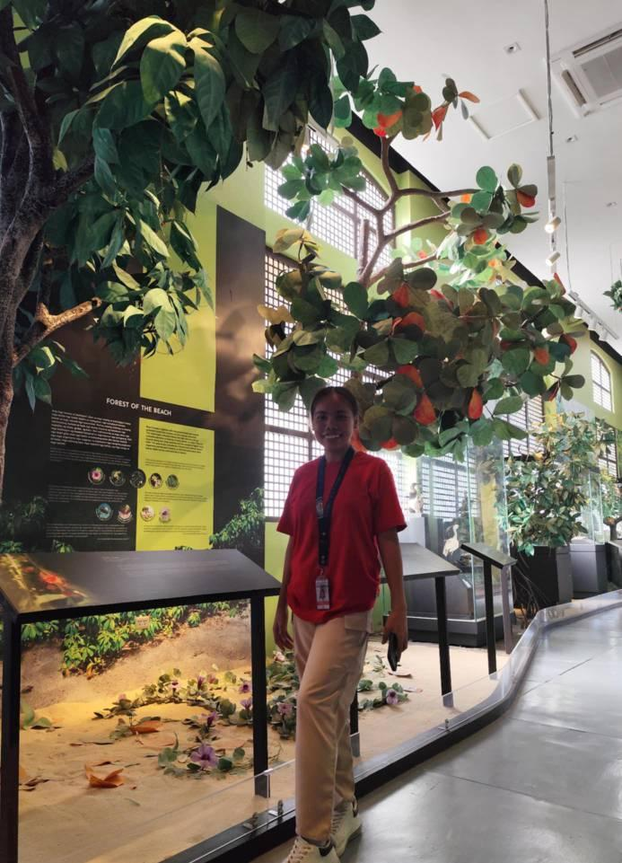
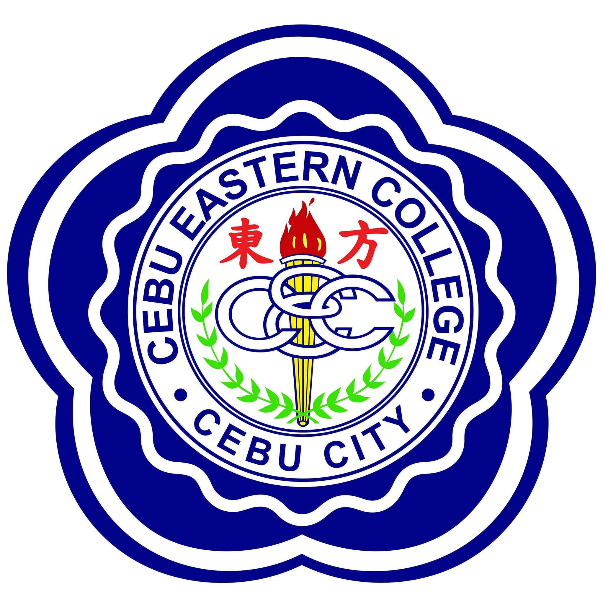
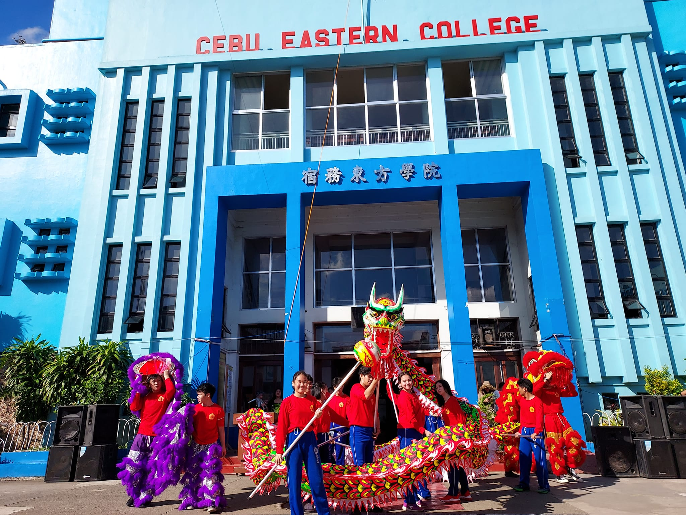

<!DOCTYPE html>
<html lang="en">
<head>
    <meta charset="UTF-8">
    <meta name="viewport" content="width=device-width, initial-scale=1.0">
    <title>My Portfolio &hearts; &#9733;</title>
    
</head>
<body>
<header>
        <nav>
            <ul> 
                <li><a href="#Aboutus">About Us</a></li>
                <li><a href="#experience">Blog</a></li>
                <li><a href="#contact" class="contact">Contact Us</a></li>
            </ul>
        </nav>  
		 
    </header>
    
    

    <!-- Main Content Section -->
    <main>
        <section class="blog-posts">
 	   
<h2 id="Aboutus">About Us</h2>

           
 <article class="post">
                <h2>Feona Lovitos</h2>
                
March 17, 2025

               
               

                
Hello! I’m Feona Lovitos, an IT student passionate about technology and problem-solving. 
				 My journey in IT has allowed me to explore various areas like software development, web design, and data analysis. 

              </article>

            <article class="post">
                <h2>Beveymae Mina</h2>
                
March 17, 2025

                   
                

                
an IT student with a strong interest in technology and innovation. I’m passionate about learning new programming languages,
				  building software, and solving complex problems. Throughout my studies, I’ve worked on various projects that have allowed me to  develop my skills in areas like coding, databases, and system administration.

                

            </article>
        </section>
    </main>

    <section class="video-container">
        <h2 id="experience">My Favorite Video</h2>
        <iframe width="560" height="315" src="https://www.youtube.com/embed/f8CuMi0csnE?si=cEQAMIiGE8YXaFQS" title="YouTube video 	player" frameborder="0" allow="accelerometer; autoplay; clipboard-write; encrypted-media; gyroscope; picture-in-picture; web-	share" referrerpolicy="strict-origin-when-cross-origin" allowfullscreen></iframe>
    </section>

    <section class="map-container">
        <h2>My University Location</h2>
        <iframe src="https://www.google.com/maps/embed?pb=!1m18!1m12!1m3!1d3925.5938830049035!2d123.89505129992061!3d10.294269269815926!	2m3!1f0!2f0!3f0!3m2!1i1024!2i768!4f13.1!3m3!1m2!1s0x33a99bfcc60d650d%3A0x5ee73506c68dd233!2sCebu%20Eastern%20College%20Cebu%	20city!5e0!3m2!1sen!2sph!4v1742031116679!5m2!1sen!2sph" width="600" height="450" style="border:0;" allowfullscreen="" 	loading="lazy" referrerpolicy="no-referrer-when-downgrade"></iframe>

    </section>

    <section class="image-map">
        <h2>Explore More</h2>
        
          &nbsp;&nbsp;&nbsp;&nbsp;&nbsp;&nbsp;&nbsp;&nbsp;&nbsp;
          
        </map>

    </section>

    <section class="image-map">
        <h2>Lists of my Favorite Emojis</h2>
    &#128512; Grinning   
    &#128640; Rocket 
    &#127881; Confetti 
    &#10084; Heart 
    &#127758; Globe 
    </section>

    <section class="image-map">
        <h2 id="contact">Contact Us</h2>
	
Facebook: Feona Lovitos | Beveymae Mina

	
Instagram: @f-nx_l | @beveymae

	
Email: feonalovitos123@gmail.com | BeveymaeMina@gmail.com

	
Contact#: 09297813747 | 09125789542 
    
    </section>
    
    <footer>
        
&copy; 2025 Feona Lovitos | Beveymae Mina | BSIT 1 SEC 4 

    </footer>
</body>
</html>
